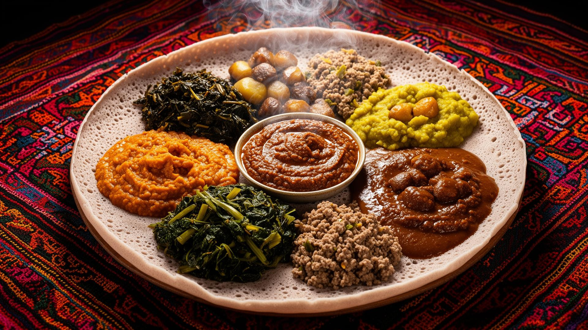

# 🇪🇹 Ethiopian Kitchen: Premium Recipe & Wellness App

Welcome to the **Ethiopian Kitchen**, a state-of-the-art mobile application designed to bring the rich culinary heritage of Ethiopia to your fingertips while promoting a healthy and active lifestyle.

## ✨ Recent Premium Overhaul
We have recently upgraded the entire application to a **Premium Experience**:
- **Professional Food Photography**: Integrated 51+ high-resolution, unique images for all traditional dishes.
- **Immersive Hero Banners**: Stunning hero platter visuals on the home screen.
- **Themed Fitness Tracking**: Lifestyle-inspired backgrounds for water, steps, and calorie tracking.
- **Cultural Texture System**: Subtle traditional Ethiopian patterns (Tibeb and Mesob) woven into the interface.
- **Enhanced Navigation**: Category-specific "mood" backgrounds (Spices, Coffee, Injera) for a tactile feel.

## 🚀 Core Features
- **🥗 100+ Authentic Recipes**: Detailed guides for stews (Wots), breads (Injera), breakfast (Chechebsa), and more.
- **👟 Integrated Fitness Tracker**: Set and monitor daily goals for steps, water intake, and calorie burn.
- **⚖️ BMI Calculator**: A premium tool to track your health and wellness goals.
- **🌍 Bilingual Support**: Seamlessly switch between **English** and **Amharic** (አማርኛ) throughout the app.
- **🛒 Smart Grocery List**: Automatically add ingredients from any recipe to your shopping list.
- **🌙 Dark & Light Mode**: A beautifully crafted UI that respects your system preferences.

## 🛠 Tech Stack
- **Framework**: React Native with Expo Router
- **Styling**: Vanilla CSS-in-JS for maximum performance and flexibility
- **Localization**: Custom translation hook supporting full UTF-8 Amharic characters
- **Icons**: Feather and Expo Vector Icons

---

*Designed with ❤️ by the Ethiopian Kitchen Team.*
